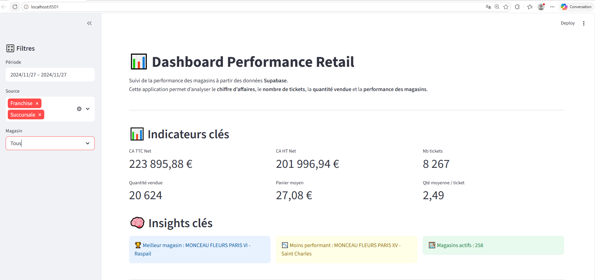

# 📊 Retail Performance Dashboard

Interactive dashboard for monitoring retail store performance.

This project transforms raw Excel sales data into an interactive dashboard using **Streamlit** and **Supabase**.

The objective is to track the performance of retail stores through key business indicators such as revenue, orders, average basket, and performance vs budget or previous year.

---
## 📷 Aperçu du dashboard

# 🚀 Project Overview

The project follows a simple modern data architecture:

Excel Data Sources → Supabase (Data Warehouse) → Streamlit Dashboard

The dashboard allows users to:

- Monitor store sales performance
- Compare results vs budget and previous year
- Identify top and underperforming stores
- Analyze revenue trends over time
- Filter results by store, region or brand

---

# 🛠 Tech Stack

- Python
- Streamlit
- Supabase (PostgreSQL)
- Pandas
- Plotly

---

# 📁 Project Structure
